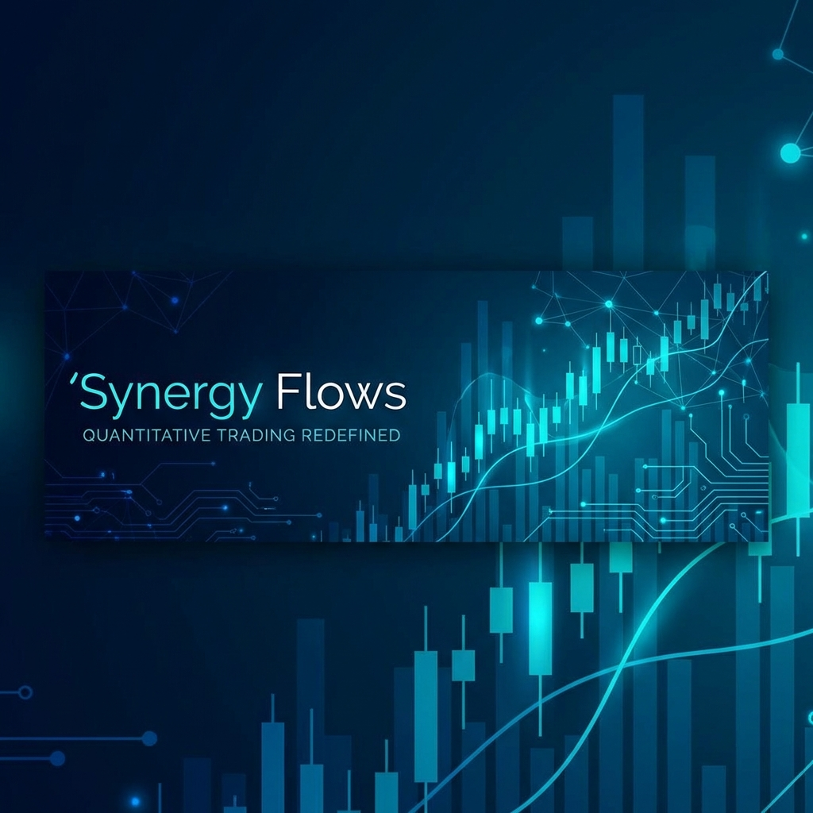

<div align="center">
  
  
  # 🌊 Synegious Flows
  ### Institutional-Grade Autonomous Quantitative Research Engine
  
  [](https://www.python.org/downloads/)
  [](#)
  [](#)
</div>

<div align="center">
  <br />
  
</div>

---

## 🏛️ Project Overview

**Synegious Flows** (v3++) is a state-of-the-art **Quantitative Research Engine** designed for the full discovery lifecycle of systematic alpha: from autonomous market regime identification and feature engineering to causal validation and portfolio optimization.

Built on the **DAMFRAPS** methodology (Detect, Analyze, Model, Filter, Rank, Allocate, Plan, Submit), the engine leverages the **MNX Module** for deep intelligence and **Alpaca** for real-world paper-trail verification.

### ⚡ Live Market Pulse
| Component | Status | Speed |
| :-- | :-- | :-- |
| **Nexus Engine** |  | Real-time |
| **MNX Optimizer** |  | 100ms calc |
| **Alpaca Bridge** |  | WebSocket |

---

## 🚀 Key Milestones

- **[x] Synegious Nexus**: Pulse-based orchestration of regime-aware strategies.
- **[x] Deep Intelligence**: 2nd-order volatility modeling and Kelly sizing.
- **[x] MNX Deep Ranker**: LightGBM-based asset ranking with causal validation.
- **[x] Live P&L Board**: Real-time Alpaca Equity and Daily P&L synchronization.

---

## 🛠️ Performance Architecture

```mermaid
graph LR
    A["📡 Market Data"] --> B["🧠 Nexus Loop"]
    B --> C["🔬 Strategy Lab"]
    C --> D["📊 MNX Optimizer"]
    D --> E["⚡ Execution Bridge"]
    E --> F["🏦 Alpaca Live"]
    
    style B fill:#0c4a6e,stroke:#22d3ee,stroke-width:2px;
    style D fill:#1e1b4b,stroke:#818cf8,stroke-width:2px;
    style F fill:#064e3b,stroke:#34d399,stroke-width:2px;
```



---

## 🚦 Setup in 60 Seconds

### 1. Provision Environment
Clone the repo and initialize your secrets:
```bash
git clone https://github.com/tokunboajayi/Synegous-Quant-Reserch.git
cp .env.example .env
```

### 2. Ignition
Launch the entire stack (API + Frontend + MNX) using Docker:
```bash
docker-compose up --build -d
```

### 3. Mission Control
Access the dashboard at: `http://localhost:8000/dashboard/`

---

## 📖 Deep Dives

- [🏁 Setup & Usage Guide](docs/HOWTO.md)
- [📄 Technical Whitepaper](docs/system_whitepaper.md)
- [🔬 Walkthrough Results](file:///C:/Users/olato/.gemini/antigravity/brain/3b6597b1-5f72-4bcc-92f4-daa8ac46c720/walkthrough.md)

---

<div align="center">
  <sub>Precision Alpha. Engineered by Antigravity.</sub>
</div>
