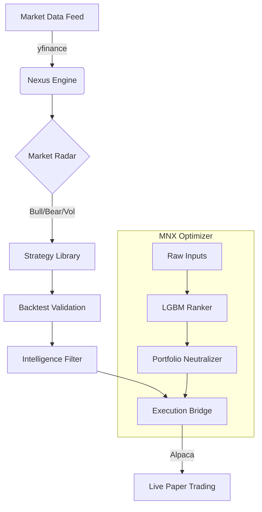

<div align="center">
  
  
  # 🌊 Synegious Flows
  ### Institutional-Grade Autonomous Quantitative Trading Framework
  
  [](https://www.python.org/downloads/)
  [](https://opensource.org/licenses/MIT)
  [](#)
  [](#)
</div>

---

## 🏛️ Project Overview

**Synegious Flows** (v3++) is a comprehensive quantitative trading platform designed for the full lifecycle of a systematic strategy: from autonomous market research and alpha generation to high-fidelity execution simulation and live broker integration.

Built on the **DAMFRAPS** methodology (Detect, Analyze, Model, Filter, Rank, Allocate, Plan, Submit), Synegious leverages the **MNX Module** for deep portfolio optimization and **Alpaca Paper Trading** for real-world P&L tracking.

### 🚀 Key Features

- **Synegious Nexus**: The autonomous core that orchestrates market regime detection, strategy selection, and validation.
- **Deep Intelligence**: Markowitz Mean-Variance Optimization and Kelly Criterion sizing based on actual 1-year historical return distributions.
- **Market Research**: Live sector performance heatmap, factor zoo, and cross-asset correlation analysis.
- **MNX Integration**: Deep learning-based rankers (LightGBM) and causal controls for high-alpha basket generation.
- **Execution Studio**: Playback and TCA (Transaction Cost Analysis) for parent order execution.

---

## 🛠️ Technical Architecture



---

## 🚦 Quick Start

### 1. Prerequisites
- **Docker** & **Docker Compose**
- **Python 3.10+** (for local development)
- **Node.js** (for frontend build)
- **Alpaca Paper Trading Keys**

### 2. Environment Setup
Create a `.env` file in the root directory:
```bash
APCA_API_KEY_ID=your_key_here
APCA_API_SECRET_KEY=your_secret_here
```

### 3. Launching with Docker
```bash
# Clone the repository
git clone https://github.com/tokunboajayi/Synegous-Quant-Reserch.git
cd Synegous-Quant-Reserch

# Build and Start
docker-compose up --build -d
```
The dashboard will be available at [http://localhost:8000/dashboard/](http://localhost:8000/dashboard/)

---

## 🧪 Documentation

- [Getting Started Guide](docs/HOWTO.md)
- [Technical Whitepaper](docs/system_whitepaper.md)
- [API Documentation](http://localhost:8000/docs)

---

<div align="center">
  <sub>Built with 💙 by Antigravity for the Quant World.</sub>
</div>
